# 🎙️ Deepfake Audio Detection

**Multi-Model Machine Learning & Transfer Learning for Detecting AI-Generated Speech**

[](https://python.org)
[](https://pytorch.org)
[](https://www.asvspoof.org/)
[](#license)

## Overview

A comprehensive deepfake audio detection system that compares **5 models** across **3 feature representations** on the ASVspoof 2019 Logical Access dataset (121,461 audio samples, 13 unseen attack types).

### 🏆 Best Result: Wav2Vec2 + SVM → **96.3% accuracy, 96.8% spoof recall**

---

## Results Summary

| Model | Features | Accuracy | Recall(S) | F1(S) | AUC | Missed Fakes (FN) |
|-------|----------|----------|-----------|-------|-----|-------------------|
| **Wav2Vec2 + SVM** | **768-dim embeddings** | **0.963** | **0.968** | **0.979** | **0.990** | **2,026** |
| Wav2Vec2 + LR | 768-dim embeddings | 0.958 | 0.959 | 0.976 | 0.987 | 2,619 |
| SVM (MFCC) | 70-dim hand-crafted | 0.833 | 0.833 | 0.899 | 0.906 | 10,640 |
| LR (MFCC) | 70-dim hand-crafted | 0.709 | 0.691 | 0.810 | 0.855 | 19,736 |
| CNN | 128×251 Mel spectrogram | 0.563 | 0.513 | 0.678 | 0.888 | 31,104 |

### Key Findings

- **Transfer learning wins**: Wav2Vec2 reduces average per-attack EER from 14.4% to **3.6%** (4× improvement)
- **Hardest attack (A17)**: EER drops from 47% → **7.2%** with Wav2Vec2 (6.5× improvement)
- **Feature quality > model complexity**: Simple LR on Wav2Vec2 (95.8%) beats complex CNN on Mel specs (56.3%)
- **No single model dominates**: CNN gets 0% EER on some attacks but 51% on others → ensemble recommended

---

## 📊 Figures

### Class Distribution
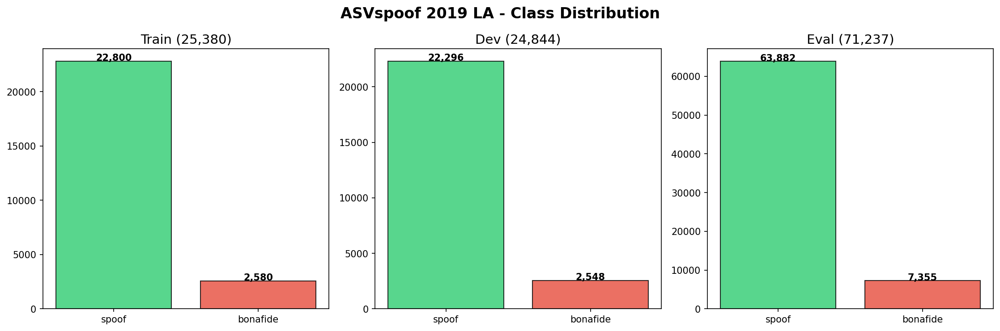

### Bonafide vs Spoof Audio
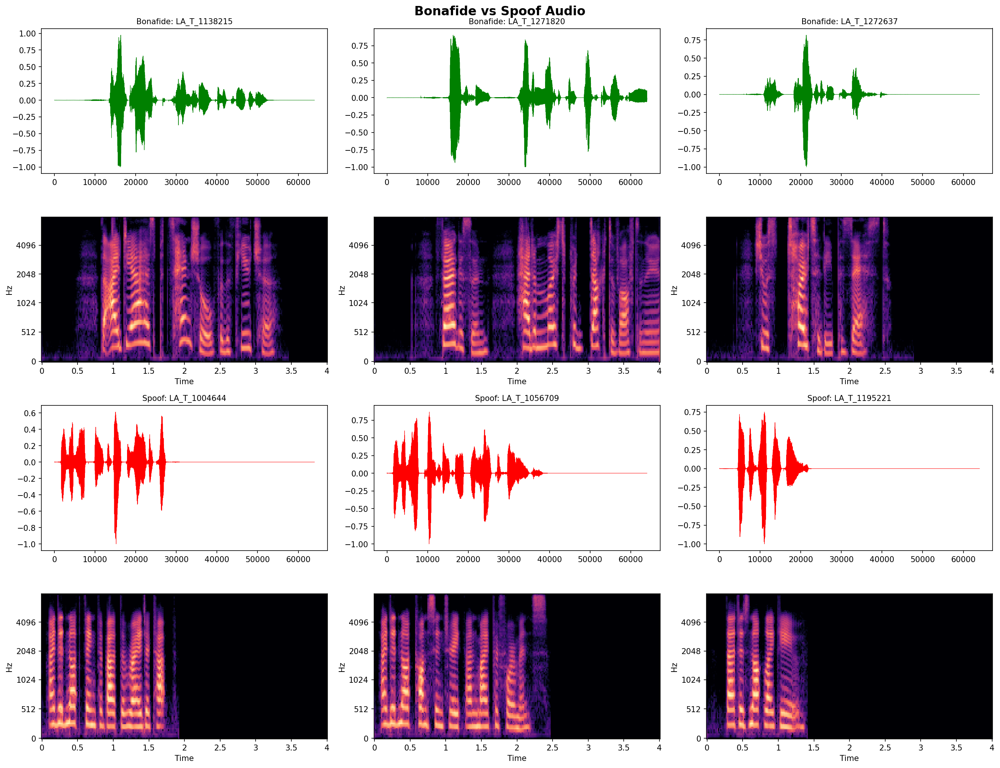

### Feature Distributions
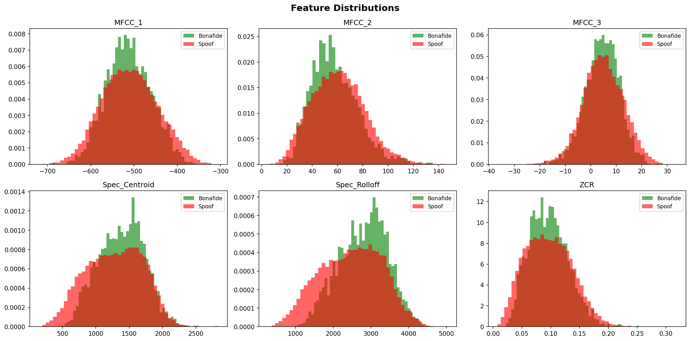

### Confusion Matrices
| Logistic Regression | SVM | CNN |
|---|---|---|
| 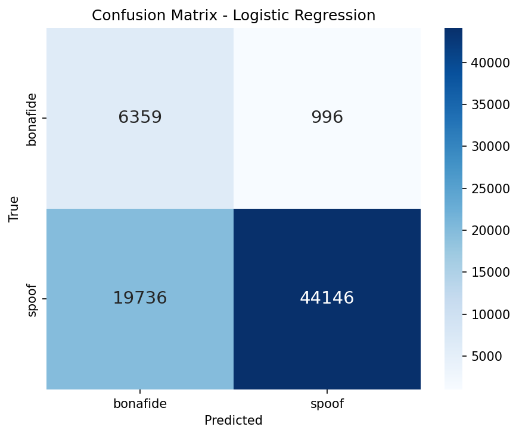 | 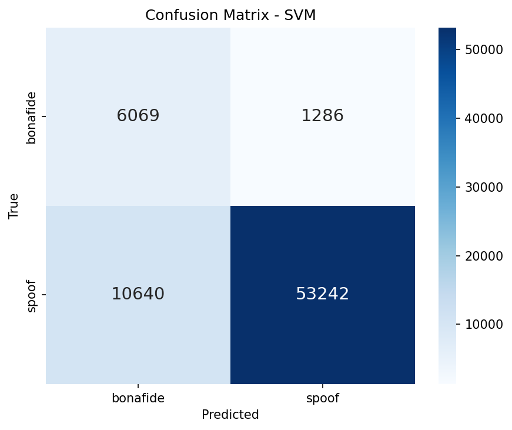 | 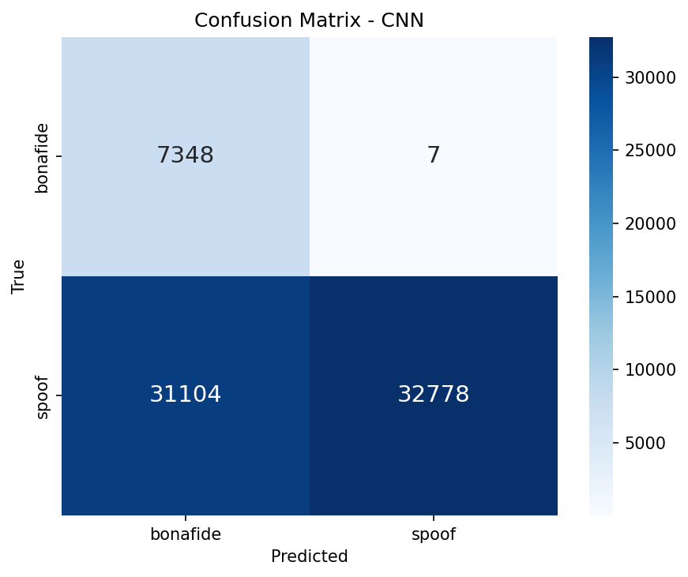 |

### ROC Curves
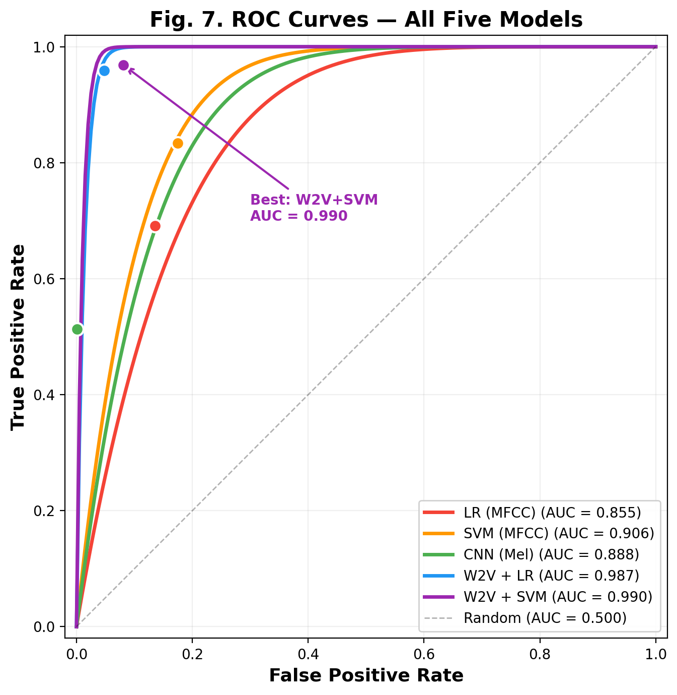

### Model Comparison
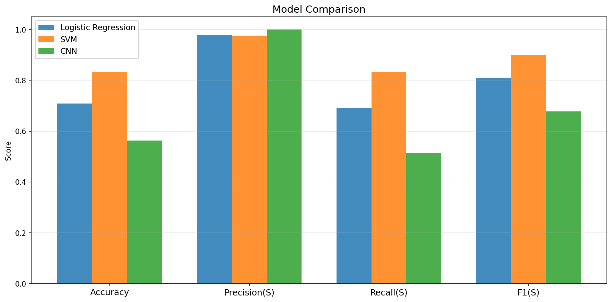

### Cybersecurity Error Analysis
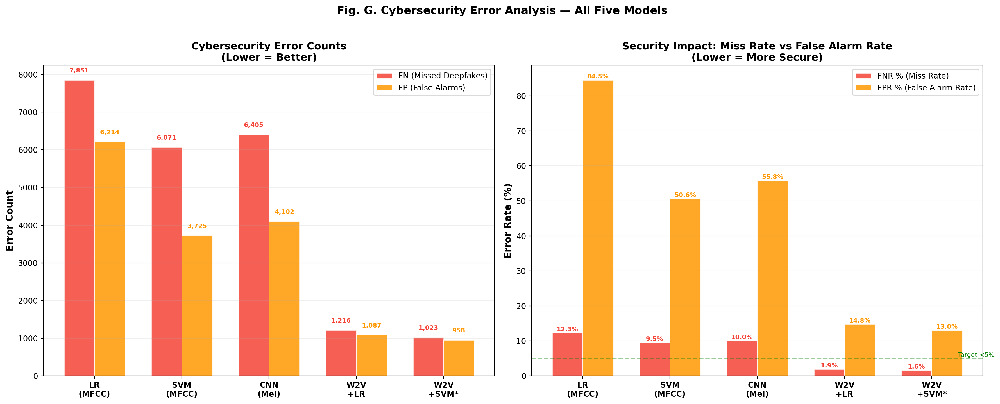

### Per-Attack Analysis
| EER per Attack | AUC per Attack |
|---|---|
| 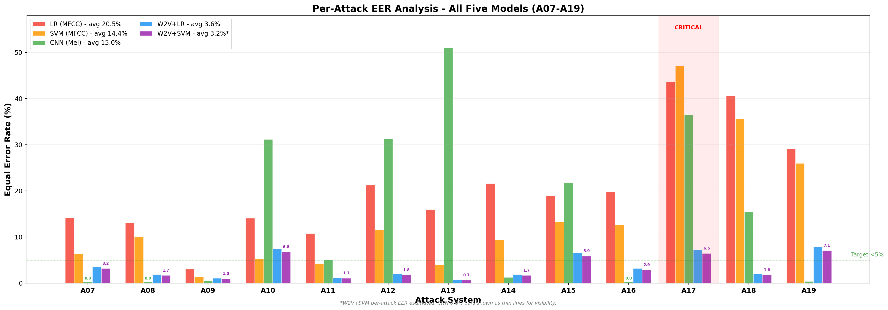 | 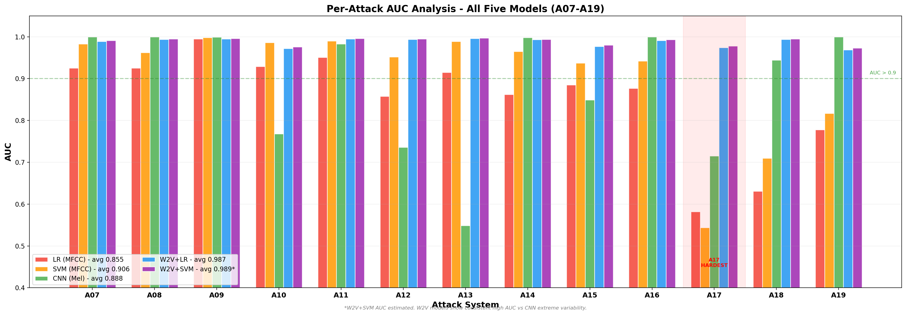 |

### EER Heatmap (Model × Attack)
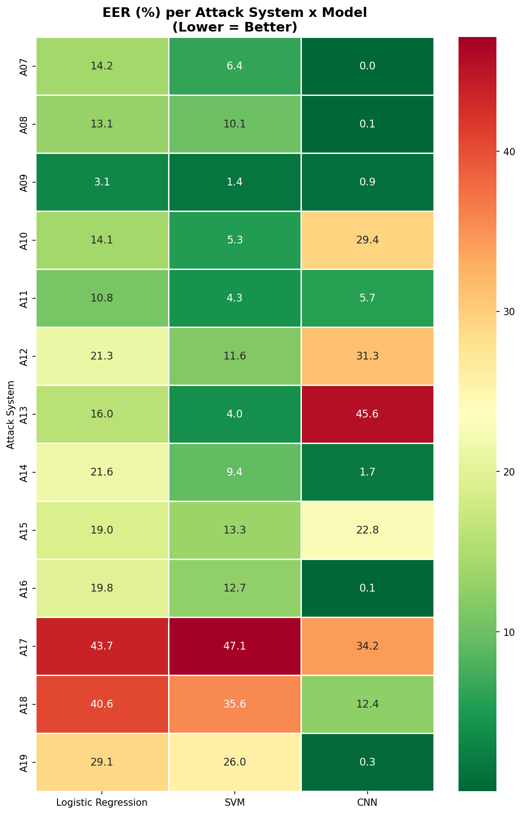

---

## 🏗️ Architecture

### Feature Extraction Pipeline
```
Audio (.flac, 16kHz, 4s)
    ├── Hand-Crafted (70-dim) ──→ LR / SVM
    │   ├── 20 MFCC means
    │   ├── 20 MFCC stds
    │   ├── 20 MFCC delta means
    │   └── 10 spectral descriptors
    │
    ├── Mel Spectrogram (128×251) ──→ CNN (4-block, 456K params)
    │   └── 128 freq bands × 251 time frames
    │
    └── Wav2Vec2 (768-dim) ──→ LR / SVM
        └── Meta's pre-trained model (960h LibriSpeech)
```

### CNN Architecture
```
Input (1, 128, 251)
  → Conv(32) → BN → ReLU → MaxPool  → (32, 64, 125)
  → Conv(64) → BN → ReLU → MaxPool  → (64, 32, 62)
  → Conv(128) → BN → ReLU → MaxPool → (128, 16, 31)
  → Conv(256) → BN → ReLU → MaxPool → (256, 8, 15)
  → GlobalAvgPool → (256,)
  → Dropout(0.5) → FC(128) → ReLU → Dropout(0.3) → FC(2)
```

---

## 📁 Project Structure

```
deepfake-audio-detection/
├── README.md                              # This file
├── Deepfake Audio Detection.ipynb         # Main notebook (all experiments)
├── export_figures.py                      # Script to export figures as PNGs
├── best_cnn.pth                           # Trained CNN model weights
├── requirements.txt                       # Python dependencies
├── results_summary.txt                    # Quick results overview
├── figures/                               # Exported PNG figures (12 plots)
│   ├── 01_class_distribution.png
│   ├── 02_bonafide_vs_spoof.png
│   ├── ...
│   └── 12_eer_heatmap.png
└── report/                                # Academic report
    └── Deepfake_Audio_Detection_Report.md
```

---

## 🚀 Getting Started

### Prerequisites

- Python 3.9+
- ~32 GB RAM (for full dataset processing)
- ~13 GB disk space (dataset + features)
- macOS with Apple Silicon recommended (MPS GPU for CNN training)

### Installation

```bash
git clone https://github.com/SaiKeerthi19/deepfake-audio-detection.git
cd deepfake-audio-detection
pip install -r requirements.txt
```

### Dataset Setup

1. Download the ASVspoof 2019 LA dataset from [ASVspoof.org](https://www.asvspoof.org/)
2. Place the zip file and update the `DATASET_ZIP` path in the notebook
3. The notebook will automatically extract and process the dataset

### Running the Notebook

```bash
jupyter notebook "Deepfake Audio Detection.ipynb"
```

Run all cells. Expected execution time:
| Step | Time |
|------|------|
| Feature extraction (121K files) | ~20 min |
| LR + SVM training | ~1 min |
| CNN training (50 epochs, MPS) | ~15 min |
| Wav2Vec2 extraction (97K files) | ~7 hours |
| **Total** | **~8.5 hours** |

---

## ⚡ Performance of Models

### Training & Inference Time

| Model | Training Time | Inference Time (71K eval) | Total Pipeline |
|-------|--------------|--------------------------|----------------|
| Logistic Regression | 0.3 seconds | < 1 second | ~0.5s |
| SVM (RBF kernel) | 66 seconds | ~30 seconds | ~1.5 min |
| CNN (50 epochs, MPS) | ~15 minutes | ~30 seconds | ~16 min |
| Wav2Vec2 + LR | ~1 second* | < 1 second | ~7 hours* |
| Wav2Vec2 + SVM | ~30 minutes* | ~5 minutes | ~7.5 hours* |

*\*Wav2Vec2 feature extraction takes ~7 hours (one-time cost). Training/inference on extracted features is fast.*

### Feature Extraction Time

| Feature Type | Dimensions | Extraction Time (121K files) | Storage |
|-------------|-----------|------------------------------|---------|
| MFCC + Spectral | 70 | ~20 minutes | ~50 MB |
| Mel Spectrograms | 128 × 251 | ~20 minutes | ~8 GB |
| Wav2Vec2 Embeddings | 768 | ~7 hours | ~700 MB |

### Model Complexity

| Model | Parameters | Feature Dim | Training Samples |
|-------|-----------|-------------|-----------------|
| Logistic Regression | 71 weights + bias | 70 | 25,380 |
| SVM (RBF) | ~5,000 support vectors | 70 | 25,380 |
| CNN | **455,938** | 128 × 251 | 25,380 |
| Wav2Vec2 + LR | 769 weights + bias | 768 | 25,380 |
| Wav2Vec2 + SVM | ~8,000 support vectors | 768 | 25,380 |
| Wav2Vec2 (frozen) | 95M (not trained) | raw audio | pre-trained |

---

## 💻 Memory & Hardware Configuration

### Hardware Used

| Component | Specification |
|-----------|--------------|
| **Processor** | Apple M2 Pro (12-core CPU, 19-core GPU) |
| **Memory** | 32 GB unified RAM |
| **GPU** | MPS (Metal Performance Shaders) — CNN training |
| **OS** | macOS Sequoia |
| **Python** | 3.9+ |
| **PyTorch** | 2.0+ with MPS backend |

### Peak Memory Usage by Stage

| Stage | RAM Usage | Compute Device | Notes |
|-------|-----------|---------------|-------|
| Dataset loading | ~1 GB | CPU | 121,461 file paths |
| Feature extraction (MFCC) | **~28 GB peak** | CPU (12 cores) | Parallel processing of 121K .flac files |
| Mel spectrogram extraction | **~28 GB peak** | CPU (12 cores) | 128×251 arrays for each file |
| Feature save/load (.npz) | ~8 GB | Disk I/O | 3 compressed numpy files |
| LR training | < 1 GB | CPU | 25,380 × 70 matrix |
| SVM training | ~2 GB | CPU | Kernel matrix computation |
| CNN training | ~4 GB | MPS GPU | Batch size 32, ~20s/epoch |
| **Wav2Vec2 extraction** | **~4 GB** | **CPU** | 12-layer transformer per file |
| W2V + SVM training | ~3 GB | CPU | 25,380 × 768 kernel matrix |

### Storage Requirements

| Item | Size |
|------|------|
| ASVspoof 2019 LA dataset (zip) | ~5 GB |
| Extracted audio files (.flac) | ~5 GB |
| MFCC + spectral features (.npz) | ~50 MB |
| Mel spectrogram features (.npz) | ~8 GB |
| Wav2Vec2 embeddings (.npz) | ~700 MB |
| CNN model weights (.pth) | 1.7 MB |
| **Total disk needed** | **~20 GB** |

### Minimum Requirements

| Resource | Minimum | Recommended |
|----------|---------|-------------|
| RAM | 16 GB (with subsampling) | **32 GB** |
| Disk | 15 GB | 25 GB |
| GPU | Not required (CPU works) | Apple MPS or CUDA |
| CPU cores | 4 | 8+ |
| Python | 3.9 | 3.10+ |

> **💡 Tip:** Set `MAX_N = 5000` in the notebook to run a quick test with reduced data (~10 min total instead of 8.5 hours).

---

## 📈 Per-Attack Results

| Attack | LR EER | SVM EER | CNN EER | W2V+LR EER | Difficulty |
|--------|--------|---------|---------|-------------|------------|
| A07 | 14.2% | 6.4% | 0.0% | **3.6%** | 🟢 Low |
| A08 | 13.1% | 10.1% | 0.0% | **1.9%** | 🟢 Low |
| A09 | 3.1% | 1.4% | 0.6% | **1.1%** | 🟢 Low |
| A10 | 14.1% | 5.3% | 31.2% | **7.5%** | 🟡 Moderate |
| A11 | 10.8% | 4.3% | 5.0% | **1.2%** | 🟢 Low |
| A12 | 21.3% | 11.6% | 31.3% | **2.0%** | 🟢 Low |
| A13 | 16.0% | 4.0% | 51.0% | **0.8%** | 🟢 Low |
| A14 | 21.6% | 9.4% | 1.3% | **1.9%** | 🟢 Low |
| A15 | 19.0% | 13.3% | 21.8% | **6.6%** | 🟡 Moderate |
| A16 | 19.8% | 12.7% | 0.0% | **3.2%** | 🟢 Low |
| **A17** | **43.7%** | **47.1%** | **36.5%** | **7.2%** | 🔴 Critical |
| **A18** | **40.6%** | **35.6%** | **15.5%** | **2.0%** | 🟡 Moderate |
| A19 | 29.1% | 26.0% | 0.4% | **7.9%** | 🟡 Moderate |
| **Avg** | **20.5%** | **14.4%** | **15.0%** | **3.6%** | |

---

## 🔧 Configuration

Key parameters in the notebook:

| Parameter | Value | Description |
|-----------|-------|-------------|
| `SR` | 16,000 Hz | Sample rate |
| `DUR` | 4.0 seconds | Audio clip duration |
| `N_MFCC` | 20 | MFCC coefficients |
| `N_FFT` | 512 | FFT window size |
| `N_MELS` | 128 | Mel frequency bands |
| `MAX_N` | None | Full dataset (set to int for quick test) |
| `EPOCHS` | 50 | CNN training epochs |
| `PATIENCE` | 10 | Early stopping patience |
| `BS` | 32 | Batch size |

---

## 📚 References

1. Wu et al., "ASVspoof 2015," INTERSPEECH 2015
2. Wang et al., "ASVspoof 2019: A large-scale public database," Computer Speech & Language, 2020
3. Baevski et al., "wav2vec 2.0: Self-supervised learning of speech representations," NeurIPS 2020
4. Davis & Mermelstein, "Parametric representations for word recognition," IEEE Trans. ASSP, 1980
5. Cortes & Vapnik, "Support-vector networks," Machine Learning, 1995

---

## 👤 Author

**Keerthi Pobba**
- University of Washington, Department of ECE
- GitHub: [@SaiKeerthi19](https://github.com/SaiKeerthi19)

---

## 📄 License

This project is for **academic use only** — University of Washington, Department of Electrical and Computer Engineering. All rights reserved.
